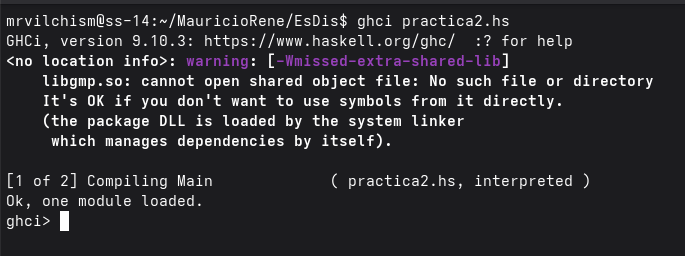

OBJETIVO DE LA PRACTICA:
Empezar a familiarizarnos con el entorno de programaciòn de haskell haciendo y poniendo a pàctica pequeñas funciones con los conocimientos adquiridos en clase

TIEMPO REQUERIDO:
Lo hice en distintos momentos del dìa asi que no sabrìa decirlo bien, pero calculo que unas 2 horas y media

COMENTARIO EXTRA:
Al querer hacer algunas al momento de investigar encontre con algo llamado "when" que creo era una forma de declarar variables en una funcion, pero no supe si lo podiamos usar, asi que los metodos o funciones son algo ineficientes por eso

